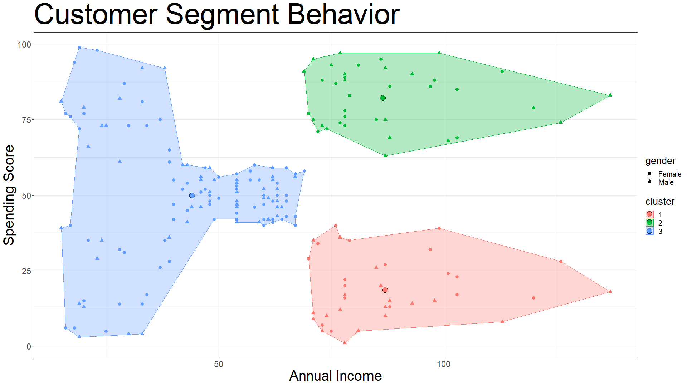
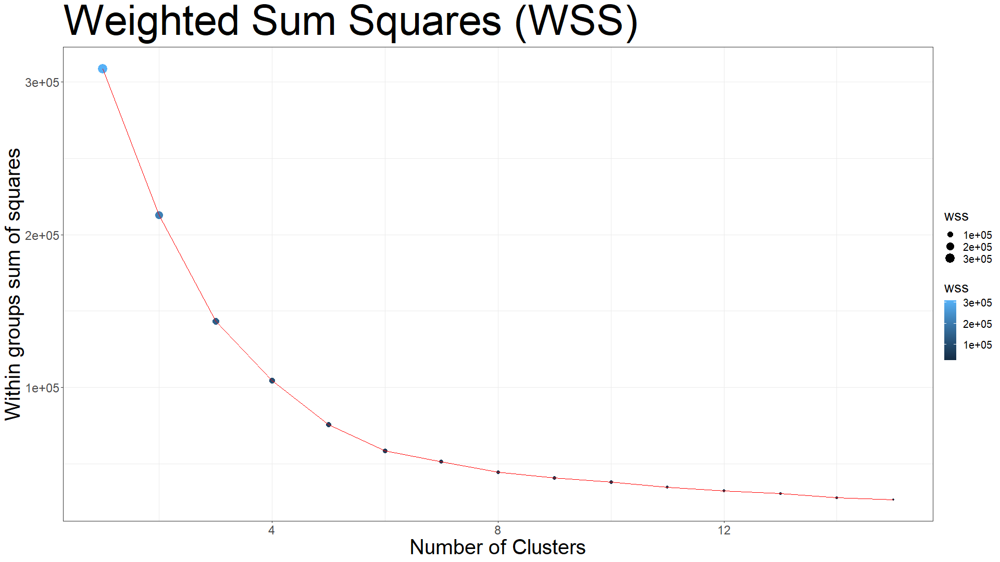
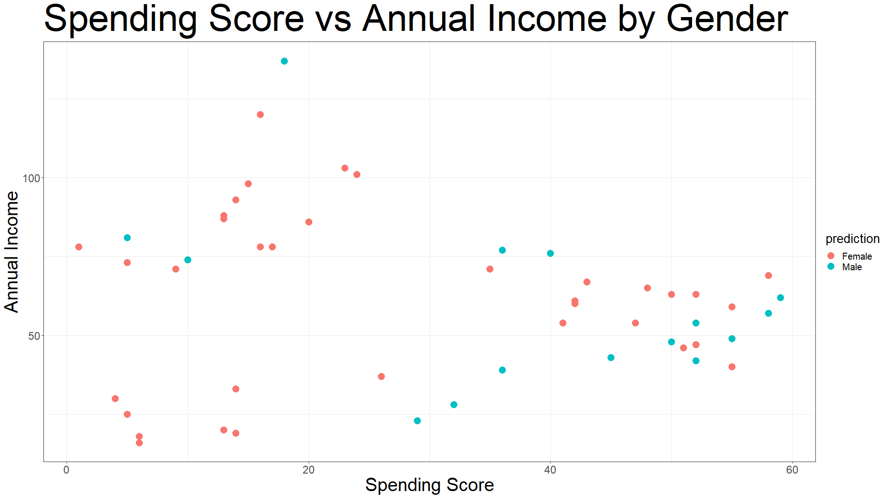
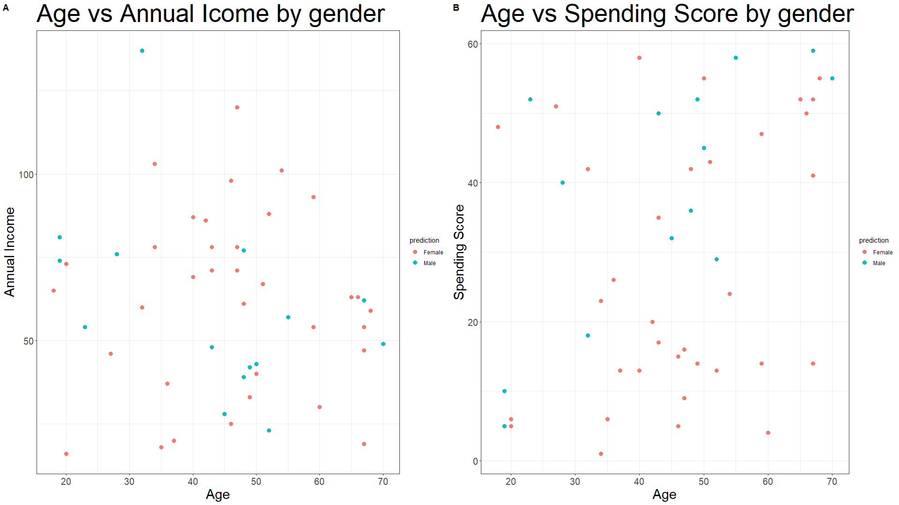
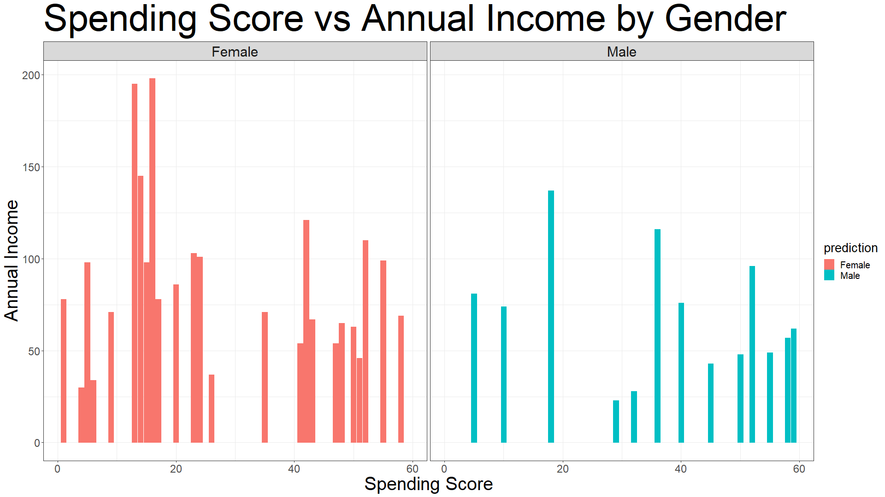
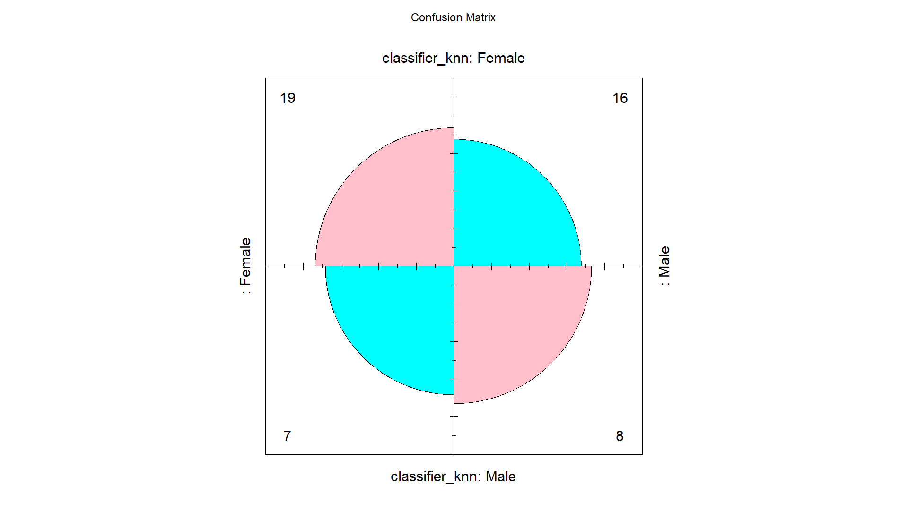
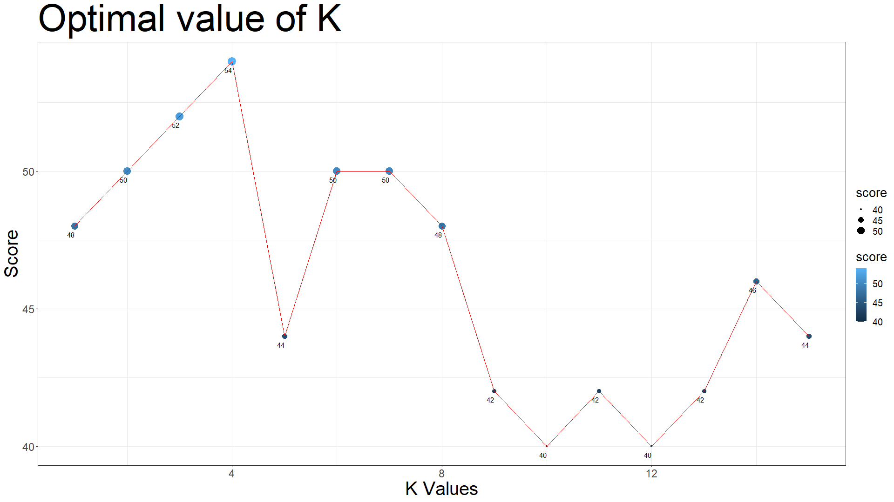

# Customer Segment Analysis


Analysis of the customers for sales targeting.

## Tech Stack


## Download

```bash
  git clone https://github.com/adionmission/Customer-Segment-Analysis.git
```

## About

In this task we can identify the type and behaviour of the customer and acccording to that we can target them for sales.
K-means clustering and K-nearest neighbour have been used for the execution of this task.
With k-means clustering, clusters where differentiate to identify the target customer, and with k-nearest neighbour, customers where classified on basis of male-feamle using spending score, income and age parameter.

## Data Pipeline in R

```bash
  data_clean = df %>%
    drop_na()
```

## About Dataset

In this task, a purchase history from Mall dataset has been used. The dataset gives the information about the customer gender, there spending score and there income.

## Data Cleaning

NAs are dropped if any and column names are renamed for easy understanding. Further ID column is removed as it is of no use.

```r
  colnames(data_clean) = c("id",
                           "gender",
                           "age",
                           "annual_income",
                           "spending_score")
```

Data types were also changed.

```r
  data_clean$age = as.numeric(data_clean$age)
  data_clean$annual_income = as.numeric(data_clean$annual_income)
  data_clean$spending_score = as.numeric(data_clean$spending_score)
```

## K-means Clustering

#### What is clustering?

It is the process of dividing the dataset into groups consisting of similar data points. It is an unsupervised learning algorithm.
 - Points in same group are similar as possible.
 - Points in different group are dissimlar as possible.

#### What is k-means clustering?

It is the clustering algorithm whose main goal is to group similar elements or data points into a cluster. K in K-means represents group of clusters.

k = 1 is the worst case scenario.



K has been set equal to 3 in the above result.

The above scenario shows that:

 - cluster 1 are the people who have higher earning but still less spending score.
 - cluster 2 are the people who have higher earning and have higher spending score.
 - cluster 3 are the people who have low earning but still higher spending score.

So as per the data, cluster 2 is the best target to increase sales.

## Optimization for k-means clustering

K can be iterated to nth number. The point where the line starts to show steepness, that's the point the value of K should be set.
In this case steepness is shown at point 3. So, K = 3. To identify this, Weighted Sum Squares formula (WSS) has been used.



## K Nearest Neighbour

The k-nearest neighbors algorithm, also known as KNN or k-NN, is a non-parametric, supervised learning classifier, which uses proximity to make classifications or predictions about the grouping of an individual data point. While it can be used for either regression or classification problems, it is typically used as a classification algorithm, working off the assumption that similar points can be found near one another.

The dataset for this task has been divided into train (80%) and test (20%).







K = 4 for above prediction.

The above graph shows the prediction on test data. The class feature used for classification in gender (Male & Female).

It means that if a customer is a female, then there is probability that she is going to spend less and if she has average income, then she is going to spend more. So, the female customers with average income and high spending is the good target segment as compared with other segments.

But, the test accuracy achieved for this prediction was 0.54 (54%) only which is not that high so can't rely of the prediction.

## Confusion Matrix



## Optimization for k-nearest neighbors

Unlike in k-means clustering, in the K nearest neighbors, value of k is determined by the square root of the total number of rows in the dataset.
But it is not an optimal option. So, n number of iteration can be performed like from 1 to the square root of the total number of rows.



As per the above graph, at K = 4, we got the highest score of 54, which means that if we use K = 4, we will achieve highest accuracy.

As per the above methods, we should choose k-means clustering method as it gave more accurate results than k nearest neighbors as we just divided into cluster for analysis and no prediction with low accuracy.

## Acknowledgements

 - [Dataset](https://www.kaggle.com/datasets/shwetabh123/mall-customers)
